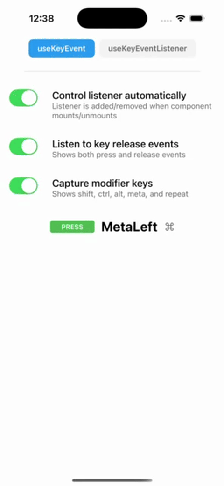
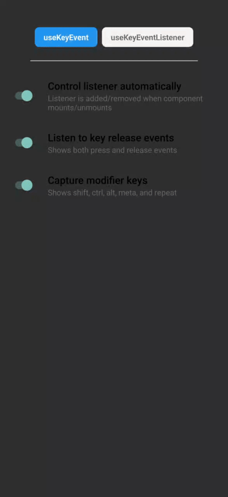
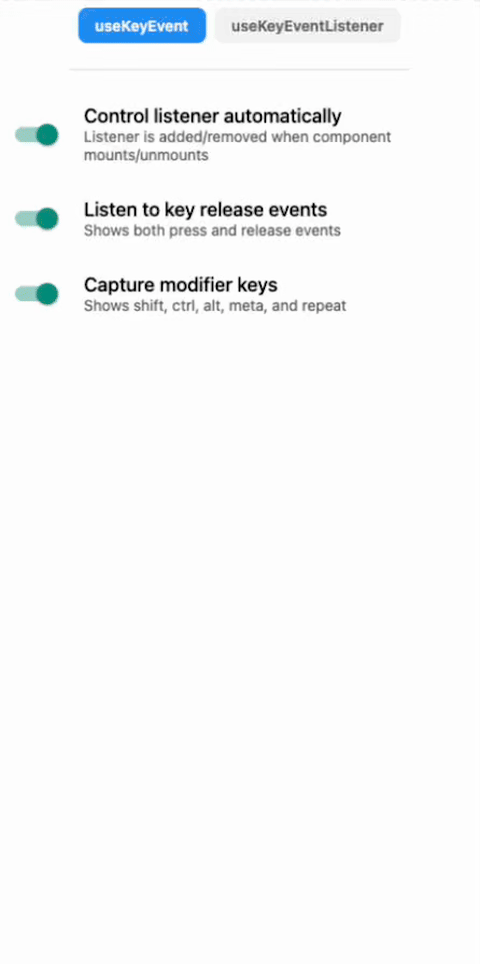

<div align="center">
  <h2 align="center">Expo-key-event</h2>

  <p align="center">
    Interface for reading key events from external devices such as Bluetooth keyboards/gamepads.
    <br />
    <a href="https://github.com/tlow92/expo-key-event?tab=readme-ov-file#getting-started">Getting started</a>
    &middot;
    <a href="https://github.com/tlow92/expo-key-event/issues/new">Report Bug</a>
  </p>
</div>

<br />
<br />

<div align="center">
  <table>
    <tr>
      <td align="center">
        <strong>iOS</strong><br/>
        
      </td>
      <td align="center">
        <strong>Android</strong><br/>
        
      </td>
      <td align="center">
        <strong>Web</strong><br/>
        
      </td>
    </tr>
  </table>

</div>

## Supported platforms

- iOS
- Android
- Web
- macOS (Mac Catalyst & react-native-macos)

## Requirements

Expo SDK >= 52

## Getting started

`npm i expo-key-event`

<br />

## Usage

Automatic listening: Key events are listened to as soon as `MyComponent` is mounted.

```tsx
import { useKeyEvent } from "expo-key-event";
import { Text } from "react-native";

export function MyComponent() {
  const { keyEvent } = useKeyEvent();

  return <Text>{keyEvent?.key}</Text>;
}
```

Manual listening: Key events are listened to when `startListening` is called.

```tsx
import { useKeyEvent } from "expo-key-event";
import { Text, View } from "react-native";

export function MyComponent() {
  // deprecated way
  // const { keyEvent, startListening, stopListening } = useKeyEvent(false);
  // new way
  const { keyEvent, keyReleaseEvent, startListening, stopListening } =
    useKeyEvent({ listenOnMount: false });

  return (
    <View>
      <Text>{keyEvent?.key}</Text>
      <Button title="Start listening" onPress={() => startListening()} />
      <Button title="Stop listening" onPress={() => stopListening()} />
    </View>
  );
}
```

Handling state yourself: If you want to handle the state yourself or don't need the state at all, you can use the `useKeyEventListener` hook instead of the `useKeyEvent` hook.

```tsx
import { KeyPressEvent, useKeyEventListener } from "expo-key-event";
import { Text, View } from "react-native";

export function MyComponent() {
  const [keyEvent, setKeyEvent] = useState<KeyPressEvent>();
  // deprecated way
  // const { startListening, stopListening } = useKeyEventListener((event) => {
  //   setKeyEvent(event);
  // }, automaticControl);
  // new way
  const { startListening, stopListening } = useKeyEventListener(
    (event) => {
      setKeyEvent(event);
    },
    {
      listenOnMount: automaticControl,
    }
  );

  return (
    <View>
      <Text>{keyEvent?.key}</Text>
      <Button title="Start listening" onPress={() => startListening()} />
      <Button title="Stop listening" onPress={() => stopListening()} />
    </View>
  );
}
```

Using modifier keys: Key events include modifier key states (shift, ctrl, alt, meta) and repeat information when `captureModifiers` is enabled.

```tsx
import { useKeyEvent } from "expo-key-event";
import { Text, View } from "react-native";

export function MyComponent() {
  const { keyEvent } = useKeyEvent({
    listenOnMount: true,
    captureModifiers: true, // Enable modifier key capture
  });

  return (
    <View>
      <Text>Key: {keyEvent?.key}</Text>
      <Text>Shift: {keyEvent?.shiftKey ? "Yes" : "No"}</Text>
      <Text>Ctrl: {keyEvent?.ctrlKey ? "Yes" : "No"}</Text>
      <Text>Alt: {keyEvent?.altKey ? "Yes" : "No"}</Text>
      <Text>Meta: {keyEvent?.metaKey ? "Yes" : "No"}</Text>
      <Text>Repeat: {keyEvent?.repeat ? "Yes" : "No"}</Text>
    </View>
  );
}
```

Checking for specific key combinations:

```tsx
import { useState } from "react";
import { KeyPressEvent, useKeyEventListener } from "expo-key-event";
import { Text } from "react-native";

export function MyComponent() {
  const [message, setMessage] = useState("");

  useKeyEventListener(
    (event: KeyPressEvent) => {
      // Check for Cmd+S (macOS) or Ctrl+S (Windows/Linux)
      if (event.key === "KeyS" && (event.metaKey || event.ctrlKey)) {
        setMessage("Save shortcut pressed!");
      }
      // Check for Shift+Enter
      else if (event.key === "Enter" && event.shiftKey) {
        setMessage("New line!");
      }
      // Check for Alt+Arrow
      else if (event.key === "ArrowRight" && event.altKey) {
        setMessage("Navigate forward!");
      }
    },
    {
      listenOnMount: true,
      captureModifiers: true, // Required to receive modifier key states
    }
  );

  return <Text>{message}</Text>;
}
```

<br />

## Run example app

`cd example`

`npm run ios` / `npm run android` / `npm run web`

<br />

## Troubleshooting

### \_expo.useEvent is not a function

This is most likely due to using Expo SDK lower than 52. `useEvent` was introduced in SDK 52.

### Error: Cannot find native module 'ExpoKeyEvent'

Make sure to use a development build and not `Expo Go`.
See https://docs.expo.dev/guides/local-app-development/ for more details.

In short: Use `npx expo run:ios` instead of `npx expo start` (make sure bundleIdentifier is set in `app.json`).

### Key events are not registered in iOS simulator

Make sure that hardware keyboard is connected to the simulator.


### Key events are not registered in Android emulator

Since the Android emulator does not support USB or Bluetooth, you need to use a physical device so that key events can be registered.

Another option is to use `adb` to send key events to the emulator.

e.g. `adb shell input keyevent 10`

<br />

## How it works

This module translates the [Apple UIKit](https://developer.apple.com/documentation/uikit/uikeyboardhidusage) and [Android KeyEvent](https://developer.android.com/reference/android/view/KeyEvent) constants to a common set of key event types matching the ones from [Web](https://developer.mozilla.org/en-US/docs/Web/API/KeyboardEvent/code).
